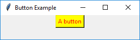

# Tkinter Examples and Screenshots

## Tkinter Button

### Source code example

```python
import tkinter as tk

window = tk.Tk()
window.title("Button Example")
window.geometry("280x50")

btn = tk.Button(window, text="A button", fg="red", bg="yellow")
btn.pack()

window.mainloop()

```

### Screenshot



## Tkinter Menu and Menubutton

## Tkinter Scale

## Tkinter OptionMenu

## Tkinter Dialogs

## Tkinter Checkbutton

## Tkinter LabelFrame and RationButton

## Tkinter PanedWindow

## Tkinter Canvas

# Exercise
 - Create a fork of this repository
 - Clone your fork locally
 - Add a source code example and a screenshot to one of the topics
 - Commit and push your changes to your fork
 - Create a pull request for your changes
